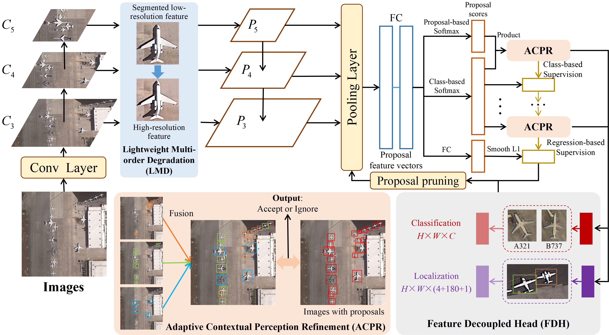
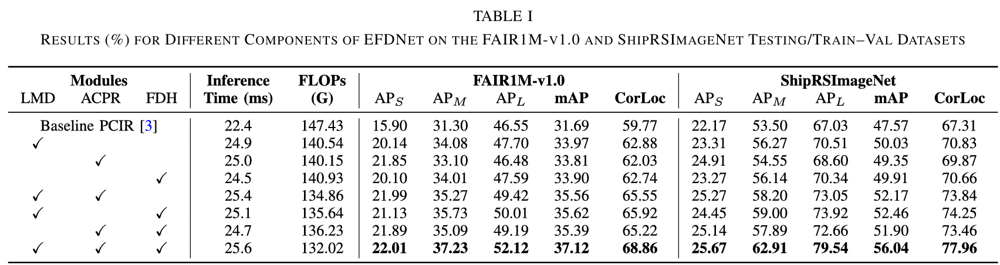
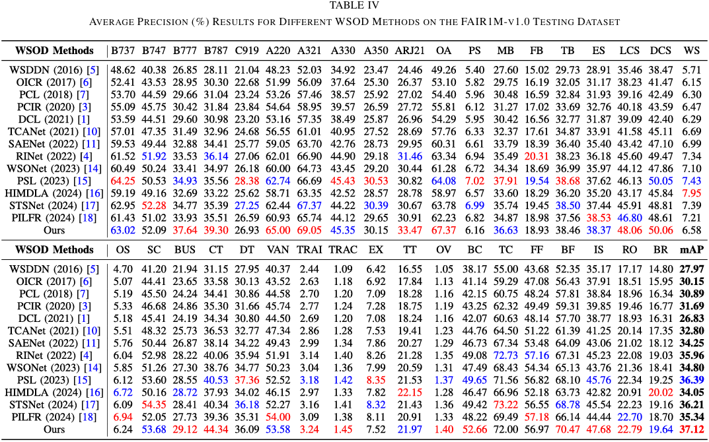
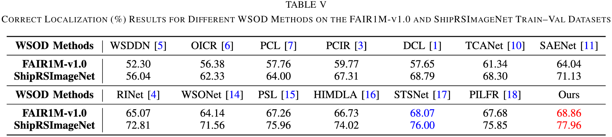
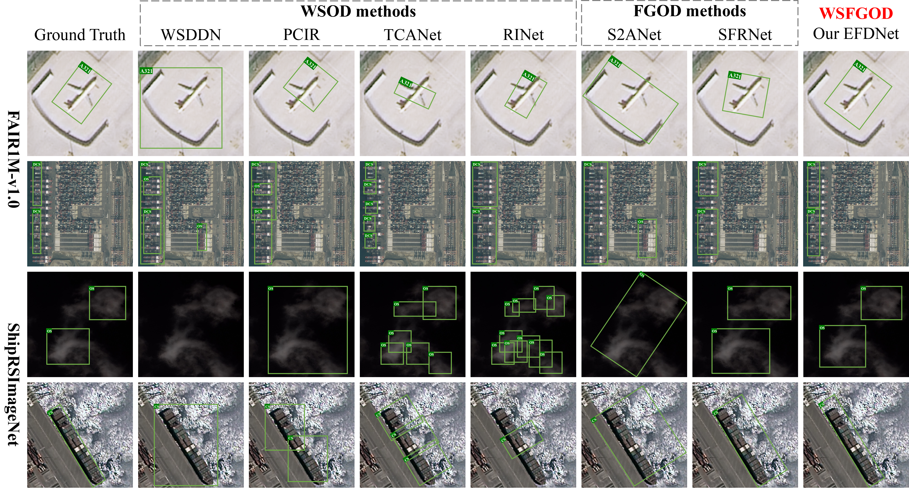

# Elaborate Feature Decoupling for Weakly Supervised Fine-Grained Object Detection in Remote Sensing Images (TGRS 2026)

Official PyTorch Implementation of EFDNet

[Paper](https://ieeexplore.ieee.org/document/11313644)

## Abstract

Currently, low-resolution fine-grained remote sensing images (RSIs) greatly affect the performance of object detectors. Meanwhile, neither weakly supervised object detection (WSOD) nor fine-grained object detection (FGOD) methods can simultaneously solve the realistic problem of dependency on top-scoring proposals during the detector training faced by WSOD, and the imbalance between fine-grained classification and localization tasks faced by FGOD. To address these issues, this article proposes a novel, elaborate feature decouple network (EFDNet), which is one of the first end-to-end frameworks to perform weakly supervised FGOD (WSFGOD) in RSIs. Specifically, a lightweight multiorder degradation (LMD) module is introduced to better simulate complex real-world degradations, thus obtaining high-resolution image features by a modular connection method of multistage feature supplementation. Our adaptive contextual perception refinement (ACPR) module aims to adaptively shift the attention of the detection network from the local feature part to the whole object by integrating local and global contextual information. Finally, we propose a feature decoupled head (FDH) module to handle the fine-grained classification and localization tasks by the classification branch (CB) and localization branch (LB), respectively. Among FDH, CB provides rich semantic information for the classification task, while LB provides more detailed texture and edge information to delineate object boundaries accurately. Extensive experiments on the challenging FAIR1M-v1.0 and ShipRSImageNet datasets demonstrate that our proposed method achieves state-of-the-art performance and is highly effective in addressing multiscale object issues.

## Framework Overview


## Experimental Results

### Ablation Studies


### Comparison Experiments




### Visualization


## Citation
If you find this repository/work helpful in your research, please consider citing:
```
@ARTICLE{yang2026EFDNet,
  author={Yang, Xi and Zhou, Zhongyuan and Yang, Dong},
  journal={IEEE Transactions on Geoscience and Remote Sensing}, 
  title={Elaborate Feature Decoupling for Weakly Supervised Fine-Grained Object Detection in Remote Sensing Images}, 
  year={2026},
  volume={64},
  pages={1-14},
  doi={10.1109/TGRS.2025.3647662}
  }
```
